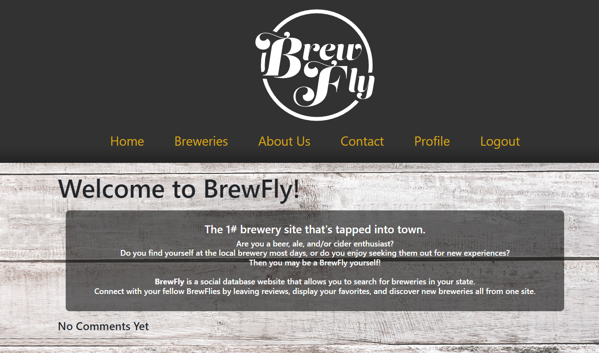

## Title

Brewfly Application

## Description

As a beer enthusiast who loves discovering new breweries and trying unique craft beers.
I want to use the Brewery Explorer App to easily explore a wide range of breweries, learn about their offerings, and plan memorable tasting adventures.

## Project URL

https://github.com/hipster-rufus/project-3-v2

## Deployment

https://project-3-v2-b959c8bb33b5.herokuapp.com/

## Demo/Screenshots

  <table>
  <tr>
    <td>Brewfly Screenshot</td>
  </tr>
  <tr>
    <td></td>
  </tr>
  </table>

## Author

Author(s):
Courtney Sherman, https://github.com/csherman177/
Kali Lott, https://github.com/hipster-rufus
